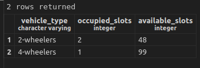

# IoT-based Parking Monitoring System
Real-time IoT based Parking Monitoring System which consumes the data from IoT sensor at the parking slots, calculated the available space and produce the processed data to Kafka topic.

# Tech stack
```
Python 3.10
Postgres 16.2 (Debian 16.2-1.pgdg120+2)
Kafka 
Zookeeper
Docker
```

## Setup

Parking monitoring system requires [docker environment](https://docs.docker.com/engine/install/ubuntu/) to run.

#### Clone [project git repository](https://github.com/hemachandraMS/parking_monitoring_sytem_iot.git)
```sh
git clone https://github.com/hemachandraMS/parking_monitoring_sytem_iot.git
```
#### In the project folder "parking_monitoring_sytem_iot" execute 
```sh
sudo docker compose -f "docker-compose.yml" up -d --build
```
> Note: In case the iotpmsapplication container exits and throws error regarding postgres container hostname not recognized, try restarting just the iotpmsapplication container.

#### Once all the container are up and running, execute iot simulation python script in local environment.
```sh
python3 vehicle_sensor_data_mimic.py
```

## Result
The above command will start broadcasting messsage to Kafka topic '**iot_sensor_data**'.

sample:
```
...
Vehicle Type: 2-wheelers, Slot Status: occupied
Vehicle Type: 4-wheelers, Slot Status: vacant
...
```

#### Attach shell using below command to view the 'iotpmsapplication' execution.
```sh
sudo docker ps -a

sudo docker exec -it <iotpmsapplication_container_id>
```

You can also listen to the Kafka topic '**parking_processed_data**' for the result.
```sh
sudo docker exec -it <kafka_container_id>

opt/kafka/bin/kafka-console-consumer.sh --bootstrap-server localhost:9092 --topic parking_processed_data --from-beginning
```

Run query on postgres '**sensor_data_db**' to fetch constructed result, requires frequent refresh to view updated data.
```sql
SELECT * FROM state_table; 
```



